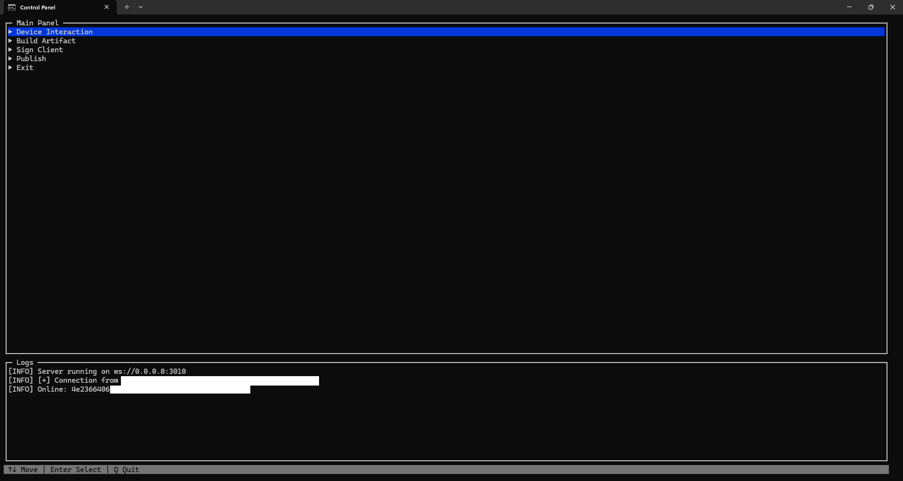
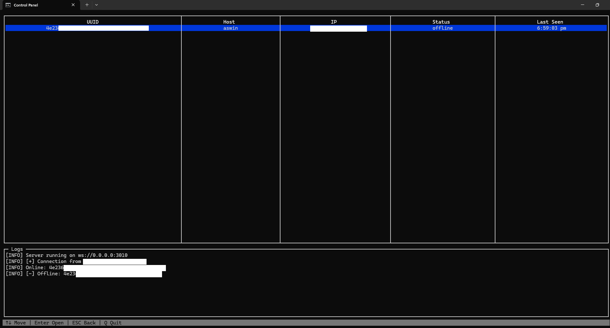

<div align="center">

  
  
  <h1>Orca C2</h1>
  
  <p>
    <strong>Lightweight • Cross-platform • Terminal-first C2 framework</strong><br>
    Remote command execution • Live streaming output • Elegant TUI dashboard
  </p>

  <!-- Badges (optional – you can add more later) -->
  <p>
    
    
    
  </p>

</div>

<br>

<p align="center">
  
</p>


## 📍 Overview

**Orca C2** is a minimalist, educational-purpose command-and-control (C2) framework written in modern JavaScript.

It consists of two main parts:

- **Server + TUI Dashboard**  
  → Runs on your control machine  
  → Blessed-based terminal user interface  
  → Real-time device list, command sending, live output streaming

- **Client (implant / agent)**  
  → Built as a portable Windows executable via Electron  
  → Connects back via WebSocket  
  → Executes commands in cmd or PowerShell  
  → Streams output live (chunked)

Designed for:

- Red team simulation & training  
- Learning C2 development  
- Understanding WebSocket-based implants  
- Terminal-first control experience

**Important:** This project is built **for educational and authorized security research purposes only**. Do not use it against systems you do not own or have explicit permission to test.

## Features

- Real-time command execution (cmd.exe & powershell.exe)
- Live streaming of command output (chunked)
- Persistent WebSocket connection with automatic reconnect
- Unique machine fingerprinting using `node-machine-id`
- Blessed-based terminal UI (TUI) control panel
- SQLite-backed device database (online/offline status, last seen, heartbeat timeout)
- One-command artifact builder (produces standalone `.exe` payloads)
- Portable Electron client (no installation needed)


### Setup

```bash
git clone https://github.com/00nx/orca-c2.git

cd orca-c2

setup.bat
```

## Architecture

```s
┌─────────────────────┐       ┌─────────────────────┐
│  Control Server     │       │  Operator Dashboard │
│  (Node.js + ws)     │◄─────►│  (Blessed TUI)      │
└──────────┬──────────┘       └─────────────────────┘
│ WebSocket
▼
┌─────────────────────┐
│  Implant / Client   │
│  (Electron + ws)    │
└─────────────────────┘
```


## Project Structure

```s
electronc2/
├── src/
│   ├── main.js           # Electron client (implant) – connects to C2, runs commands
│   ├── server/
│   │   ├── server.js     # WebSocket + HTTP control server
│   │   └── database.js   # SQLite device management
│   ├── ui/
│   │   ├── dashboard.js  # Blessed TUI control panel
│   │   └── outputBus.js  # Pub/sub for live command output
│   └── utils/
│       ├── builder.js    # Builds standalone client .exe
│       └── logger.js     # Centralized logging to TUI
├── builds/               # Generated artifacts go here
├── package.json
└── index.js              # Entry point (starts server + dashboard)
```

## 📸 Previews

<div align="center">
  <table>
    <tr>
      <td><strong>Main Dashboard</strong></td>
      <td><strong>Device List</strong></td>
    </tr>
    <tr>
      <td>
        
      </td>
      <td>
        
      </td>
    </tr>
    <tr>

  </table>
</div>

<br>


> [!WARNING]
> Default port is local at 3010. You will have to use ngrok or cloudflared in order to make it public.

> [!CAUTION]
> **This tool is provided strictly for educational purposes, red team engagements with explicit written permission, and authorized security research.**

> **Unauthorized use against any system or network without consent is illegal and unethical.**

